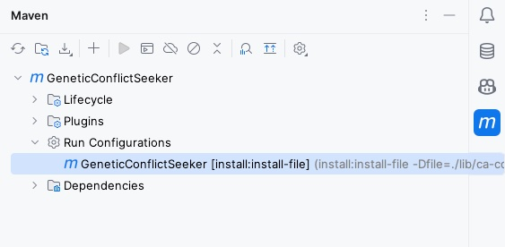

# GeneticConflictSeeker

Before running the program, you need to install the jar archive provided in the **lib** folder. 
If you're using IntelliJ IDEA, you can do this by accessing the Maven tab on the right sidebar and 
selecting the **GeneticConflictSeeker** configuration (see the image provided below).

Once installed, click the **Reload All Maven Projects** icon to refresh the project. 
From there, you can easily run the program by executing the *main* methods.