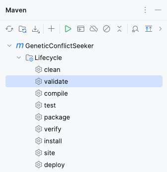
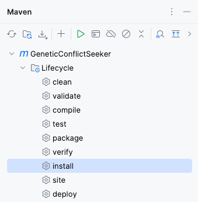
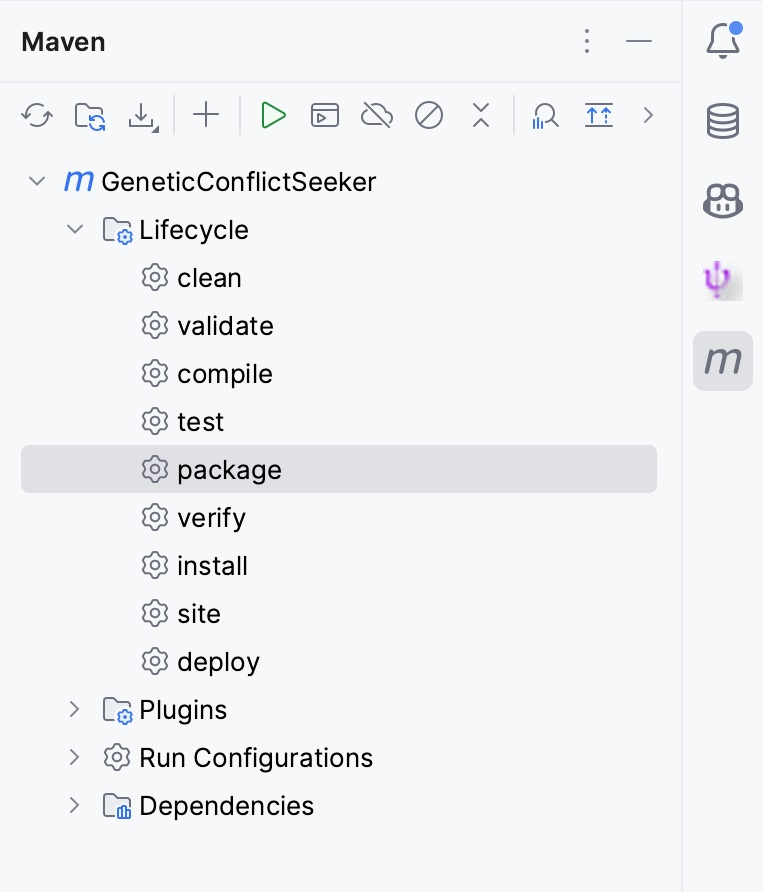
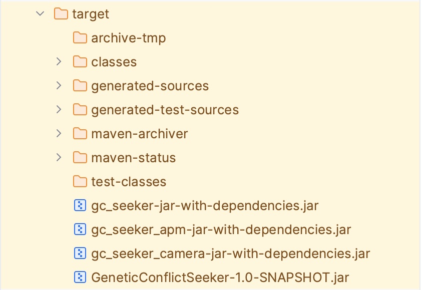

# GeneticConflictSeeker

## Install the provided lib

Run the validation phase:



After this step, install the library:



Once the compile phase does execute, the lib ca-cdr-1.0.1-alpha-22.jar is correctly installed in your local repository, 
just as any other artifact that may have been retrieved from Maven central itself.

## Build jar files

Activate the Maven profile **package** to build the jar files.



After the build is complete, you can find the jar files in the **target** folder.



## gc_seeker-jar-with-dependencies.jar

This app is designed for feature models, e.g., DELL.splx.

```shell
java -jar gc_seeker-jar-with-dependencies.jar -cfg ./conf/gc_seeker.cfg
```

## gc_seeker_apm-jar-with-dependencies.jar

This app is designed for APM KB.

```shell
java -jar gc_seeker_apm-jar-with-dependencies.jar -cfg ./conf/gc_seeker_apm.cfg
```

## gc_seeker_camera-jar-with-dependencies.jar

This app is designed for CameraKB.

```shell
java -jar gc_seeker_camera-jar-with-dependencies.jar -cfg ./conf/gc_seeker_camera.cfg
```